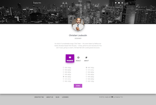

# DUHWAN JANG
>Programming is **如切如磋 如琢如磨**

Hi, my name is DuHwan Jang. I'm a software developer from Korea
Who loves to write software to build great products and help businesses succeed with their goals.
I love my work and want to contribute to this industry. So, I follow software craftsmanship.
I believe that we could change the world and solve the problem in the world.
If you believe that please contact me.
I want to work with you.

## PERSONAL INFORMATION
* * *
<dl>
<dt>Name</dt>
<dd>DuHwan Jang</dd>
<dt>Born</dt>
<dd>7/5/1986</dd>
<dt>Birthplace</dt>
<dd>Korea</dd>
<dt>Language</dt>
<dd>Korean, English</dd>
<dt>Manifesto</dt>
<dd>Software Craftsmanship</dd>
</dl>

>동작하는 소프트웨어 뿐만 아니라, **정교하고 솜씨있게 만들어진 작품을**
>
>변화에 대응하는 것뿐만 아니라, **계속해서 가치를 더하는 것을**
>
>개별적으로 협력하는 것뿐만 아니라, **프로페셔널 커뮤니티를 조정하는 것을**
>
>고객과 협업하는 것뿐만 아니라, **생산적인 동반자 관계를**

## CONTACT INFORMATION
* * *
<dl>
<dt>Mobile</dt>
<dd>010-2524-9037</dd>
<dt>Email</dt>
<dd>e.where.people.enjoy@gmail.com</dd>
<dt>SNS</dt>
<dd>Kakao talk ID : Soondingee</dd>
<dd>Facebook : e.where.people.enjoy@gmail.com </dd>
</dl>

<dl><dt>Blog</dt></dl>

 [티스토리 블로그](http://dontstopthinking.tistory.com).


## Purpose Drive Development
* * *

#### [](#header-4)Anything I can do.
```
생각한 것을 실현하고 가장 빠르게 확인 할 수 있는 강력한 도구
많은 사람들에게 많은 영향력을 끼칠 수 있다는 것
프로그래밍은 이제까지 한 일들 중에 가장 즐거운 일입니다.
```

#### [](#header-4)Make the World Better
```
사람들의 삶의 양식을 변화시키고
세상을 지금보다 더 합리적으로 만들고 싶습니다
가장 강력하고 확실한 방법은 프로그래밍이라고 생각합니다.
```

#### [](#header-4)Definite Performance.
```
코드와 관련된 일이 아니라도 프로젝트의 성공을 전적으로 돕습니다
혼자 사업을 기획부터 개발까지 수행한 사업이 2017년 기준으로 7억 원입니다
사용한 언어는 C#, JAVA, ANDROID까지 다양합니다
필요하면 빠르게 학습하고 주어진 목표를 달성합니다.
```

#### [](#header-4)Knowledge sharing
```
서로를 더 성장시킬 만한 사람들과 함께 일하길 원합니다
사내에서 알고리즘, 자료구조, 디자인 패턴 관련한 스터디 그룹을 만들고 이끌었습니다
덕분에 개발 소스 코드의 품질이 올라가고 활발한 의사소통으로 과제를 원활하게 수행했습니다.
```


## What I Do
* * *

#### Programming Language

* C# - _가장 많이 사용_
* Javascript - _최근 많이 사용_

#### Framework
* Winform(.NET 4.0)  - _가장 많이 사용_
* angular - _최근 많이 사용_
* Node.js - _최근 많이 사용_

#### OS
* Linux(서버 운영으로 최근 사용 중)

#### DataBase
* MongoDB, MSSQL, ORACLE

#### Cloud
* AWS - 시스템 구조 및 운영 작업 수행

#### Others
* Git, TeamFoundation
* TDD(Test Driven Development)
* Coding Convention(pep8)

## Education Qualification
* * *

<dl>
<dt>KNU(경북대학교) - 2005. 03 ~ 2009. 02</dt>
<dd>Landscape Architect</dd>
</dl>

## Certificate
* * *

#### 정보처리기사
* 2016년 5월 취득

## Personal Projects
* * *

#### I feel connect with you (연결)
* Content : This App to vote for a favorite person after a meeting.
* Skill : Python, Django, Sqlite3
* Github Source : [Git hub source](https://github.com/ThinkAllofYours/ilikeu.git)
* Screen Shot



## Company Projects
* * *

#### 테이블매니저 - 2017. 08 ~ 재직중
    - 직책 : 연구개발팀 매니저
    - 업무 : Node.js, javascript, angular, mongodb, aws를 활용한 솔루션 개발

#### 영진글로지텍 - 2014. 11 ~ 2017. 07
    - 직책 : 솔루션 사업부 팀장
    - 업무 : C#, WPF, MSSQL을 활용한 솔루션 개발


